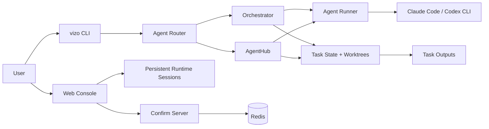

# Vizo

[简体中文](README.zh-CN.md) | English

Vizo is a browser-based workbench and workflow layer for using Codex and Claude
Code on Linux. Both tools are powerful in the terminal, but a pure CLI leaves
important gaps: images are hard to inspect, generated documents are awkward to
preview, long-running tasks are difficult to follow visually, and users who run
both Codex and Claude Code have to switch between multiple commands and
sessions.

Vizo keeps the CLI power underneath, then adds the missing product surface on
top: a Web Console, image and document previews, persistent sessions, task
history, model/runtime switching, and a structured development workflow that can
carry a request from idea to tested implementation.

This repository is the public distribution of Vizo. It is generated from a
private working repository through a whitelist sync process. Runtime state,
private project checkouts, local memories, real configuration files, logs,
screenshots, tool caches, and unpublished planning archives are intentionally
excluded.

## Why Vizo Exists

Vizo starts from a practical problem: Codex and Claude Code are excellent CLI
agents, but the terminal is not a complete client experience.

- **Linux users need a real workbench**: Vizo adds a browser interface for
  sessions, task state, logs, generated files, image previews, and document
  previews.
- **Multi-runtime users need one place to work**: Vizo lets people use Codex and
  Claude Code through one project console instead of constantly switching
  between separate CLI sessions.
- **Long tasks need workflow control**: Vizo records progress, outputs, costs,
  recovery points, confirmations, pause/resume state, and rollback points.
- **Non-programmers need a development process, not a prompt box**: a product
  manager can describe a requirement and let Vizo run a full development
  workflow with requirement analysis, PRD writing, architecture, frontend and
  backend implementation, integration, testing, fixes, and documentation.
- **Teams need reusable structure**: Vizo keeps role prompts, project memory,
  AgentHub modules, and task outputs organized instead of leaving everything in
  disposable terminal scrollback.

The default entry point is `vizo`. The older `opus.py` entry point remains in
the codebase as a compatibility layer because parts of the runtime still share
the historical Opus naming.

## Core Capabilities

- **Unified client for Codex and Claude Code**: manage Linux CLI-based AI
  sessions from one browser console, with runtime/model switching and persistent
  project context.
- **Richer than a terminal**: preview images, generated Markdown/documents,
  task outputs, logs, and browser artifacts without leaving the Vizo console.
- **Full development workflow for non-programmers**: turn a natural-language
  requirement into a staged delivery process handled by roles such as
  requirement analyst, product manager, architect, frontend developer, backend
  developer, integration engineer, QA, and fix engineer.
- **Multi-agent software delivery**: break complex work into role-based stages,
  enforce confirmations where needed, and preserve every output as a traceable
  task artifact.
- **Task control and recovery**: pause, resume, terminate, rollback to a
  workflow step, view history, inspect costs, and replay work logs.
- **Model routing and fallback**: configure role-level model preferences across
  Claude Code, Codex, and external model endpoints.
- **AgentHub modules**: run manifest-driven workflows for domain-specific work.
  The public repo currently includes built-in contract service and interaction
  design modules.
- **Local-first deployment**: run with Docker Compose as an all-in-one stack, or
  use a local Python process with Redis.

## Architecture At A Glance



The normal service process is `python3 -m vizo_core.secretary`. It starts and supervises
`lib/confirm_server.py`, which serves the Web Console, confirmation pages, task
APIs, output previews, mobile console, and Chrome bridge endpoints.

## Repository Layout

| Path                       | Purpose                                                                    |
| -------------------------- | -------------------------------------------------------------------------- |
| `vizo`, `vizo.py`          | Public CLI shim and branded entry point.                                   |
| `opus.py`                  | Legacy compatibility entry point.                                          |
| `vizo_core/`               | CLI implementation, orchestration, AgentHub, agent runtime, UI, and state. |
| `lib/confirm_server.py`    | Web server, task APIs, confirmation pages, previews, and console routes.   |
| `lib/web_console.py`       | Desktop Web Console SPA handlers and APIs.                                 |
| `lib/mobile_console.py`    | Mobile Console handlers.                                                   |
| `lib/runtime/`             | Persistent Claude Code and Codex session runtimes.                         |
| `hooks/`                   | Tool-use, session-start, stop, and compaction hooks.                       |
| `role_templates/`          | Built-in role prompts and referenced document templates.                   |
| `agents/_builtin/`         | Built-in AgentHub modules.                                                 |
| `docs/`                    | Focused operational documentation.                                         |
| `tests/`                   | Public regression tests.                                                   |
| `PUBLIC_SYNC_MANIFEST.txt` | Whitelist that defines what can be copied into this public repo.           |

## Quick Start With Docker Compose

Docker Compose is the recommended way to evaluate Vizo because it starts the
application and Redis together.

```bash
git clone <your-vizo-repo-url>
cd vizo-public

cp config.json.example config.json
cp .env.example .env
```

Edit `.env` and set at least:

```bash
ANTHROPIC_API_KEY=sk-ant-...
```

For the default Compose port mapping, make sure `config.json` uses port `9390`:

```json
{
  "confirm_server": {
    "host": "0.0.0.0",
    "port": 9390
  }
}
```

Start the stack:

```bash
docker compose up -d --build
docker compose logs -f vizo
```

Open:

- Web Console: `http://127.0.0.1:9390/vizo/console`
- Health check: `http://127.0.0.1:9390/vizo/health`
- Mobile Console: `http://127.0.0.1:9390/vizo/m`

Full production notes, local-process deployment, reverse proxy examples, and
troubleshooting are in [docs/DEPLOYMENT.md](docs/DEPLOYMENT.md).

## Local CLI Setup

Use a local Python environment when developing Vizo itself or when you want to
run the CLI without containers.

```bash
python3 -m venv .venv
source .venv/bin/activate
pip install -r requirements.txt

cp config.json.example config.json
cp .env.example .env
```

Install and authenticate the AI CLI runtime you plan to use, then make it
available on `PATH`. The Docker image preinstalls Claude Code, Codex, Playwright
MCP, and Chromium; a local process expects equivalent tools to be installed by
the operator.

Run Vizo:

```bash
./vizo "add a login rate limit"
./vizo --chat "summarize the current project"
./vizo --history
./vizo --cost
./vizo --resume
```

Start the Web service directly:

```bash
python3 lib/confirm_server.py start -f -p 9390
```

Or start the supervisor:

```bash
python3 -m vizo_core.secretary
```

## Common CLI Commands

| Command                                     | What it does                                              |
| ------------------------------------------- | --------------------------------------------------------- |
| `./vizo "task"`                             | Start a routed task.                                      |
| `./vizo "task" --dev`                       | Force the development workflow and skip AgentHub routing. |
| `./vizo --workflow bug_fix "task"`          | Run a specific development workflow.                      |
| `./vizo --chat "question"`                  | Answer directly without the full workflow.                |
| `./vizo --task`                             | List tasks.                                               |
| `./vizo --task <task_id>`                   | Show one task.                                            |
| `./vizo --pause [task_id]`                  | Request a task pause.                                     |
| `./vizo --resume [--task-id <task_id>]`     | Resume an incomplete task.                                |
| `./vizo --rollback <task_id> --step <step>` | Roll back to a workflow step.                             |
| `./vizo --terminate <task_id>`              | Terminate a task, with rollback by default.               |
| `./vizo agents`                             | List installed AgentHub modules.                          |

## Configuration

Vizo reads `config.json` and then applies supported environment overrides. Keep
real secrets out of Git. Use `.env` for local development and your deployment
platform's secret store in production.

Important variables include:

| Variable                                          | Purpose                                          |
| ------------------------------------------------- | ------------------------------------------------ |
| `ANTHROPIC_API_KEY` or `OPUS_MAIN_API_KEY`        | Main Anthropic-compatible API key.               |
| `ANTHROPIC_BASE_URL`                              | Optional Anthropic-compatible endpoint override. |
| `DEEPSEEK_API_KEY`, `GLM_API_KEY`, `QWEN_API_KEY` | Optional external model keys.                    |
| `REDIS_HOST`, `REDIS_PORT`                        | Redis connection override.                       |
| `CONFIRM_SERVER_HOST`, `CONFIRM_SERVER_PORT`      | Web service bind settings.                       |
| `PUBLIC_BASE_URL`                                 | Public URL used when generating preview links.   |

## Web Routes

The primary route prefix is `/vizo`. The server also registers versionless
aliases for many routes, but new documentation and integrations should prefer
the explicit `/vizo/...` paths.

| Route                        | Purpose                          |
| ---------------------------- | -------------------------------- |
| `/vizo/console`              | Desktop Web Console.             |
| `/vizo/console/setup`        | First-run setup wizard.          |
| `/vizo/tasks`                | Task list page.                  |
| `/vizo/tasks/{task_id}`      | Task detail page.                |
| `/vizo/confirm/{request_id}` | Human confirmation page.         |
| `/vizo/preview/{preview_id}` | Output preview page.             |
| `/vizo/docs/`                | Generated task document listing. |
| `/vizo/chrome/connect`       | Chrome bridge connection page.   |
| `/vizo/health`               | Service health check.            |

## Testing

Public regression tests live in `tests/`.

```bash
python3 -m pytest tests
```

Run focused tests when working on a specific subsystem, for example:

```bash
python3 -m pytest tests/test_sync_public_repo.py
python3 -m pytest tests/test_confirm_server_status.py
```


## More Documentation

- [Deployment Guide](docs/DEPLOYMENT.md)
- [User Manual](docs/USER-MANUAL.md)
