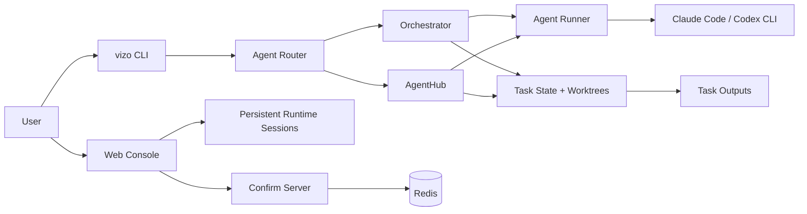

# Vizo

Vizo is a local AI collaboration workbench for software delivery. It combines a
multi-agent CLI, a browser console, task recovery, and model routing so that
larger coding tasks can move through analysis, planning, implementation,
verification, and documentation with explicit human control points.

This repository is the public distribution of Vizo. It is generated from a
private working repository through a whitelist sync process. Runtime state,
private project checkouts, local memories, real configuration files, logs,
screenshots, tool caches, and unpublished planning archives are intentionally
excluded.

## Why Vizo Exists

Most AI coding tools are optimized for a single interactive session. Vizo is
designed for longer work that needs orchestration:

- break a request into role-based workflow stages;
- run specialized agents with controlled tool permissions;
- preserve task state, cost records, outputs, and recovery points;
- expose the work through both CLI and browser interfaces;
- route non-development requests to reusable AgentHub modules;
- keep local project knowledge separate from disposable chat context.

The default entry point is `vizo`. The older `opus.py` entry point remains in
the codebase as a compatibility layer because parts of the runtime still share
the historical Opus naming.

## Core Capabilities

- **Multi-agent development workflows**: requirement analysis, product planning,
  architecture, implementation, integration, QA, fixes, deployment checks, and
  knowledge capture.
- **AgentHub modules**: manifest-driven workflows for domain-specific tasks.
  The public repo currently includes built-in contract service and interaction
  design modules.
- **Model routing and fallback**: role-level model preferences, Claude Code and
  Codex runtime support, and external model configuration.
- **Task control**: pause, resume, terminate, rollback to a workflow step, view
  history, inspect costs, and replay work logs.
- **Web Console**: browser-based sessions, project/task management, live events,
  settings, runtime diagnostics, MCP service management, and output previews.
- **Mobile Console**: a compact control surface for task review and operations
  on phones or tablets.
- **MCP integration**: project memory through Serena, Chrome bridge, Vizo
  routing tools, and optional browser automation services.
- **Local-first deployment**: Docker Compose for an all-in-one stack, or a local
  Python process with Redis.

## Architecture At A Glance



The normal service process is `secretary.py`. It starts and supervises
`lib/confirm_server.py`, which serves the Web Console, confirmation pages, task
APIs, output previews, mobile console, and Chrome bridge endpoints.

## Repository Layout

| Path | Purpose |
| --- | --- |
| `vizo`, `vizo.py` | Public CLI shim and branded entry point. |
| `opus.py` | Main CLI implementation and compatibility entry point. |
| `orchestrator.py` | Development workflow selection and execution. |
| `agent_runner.py` | Agent subprocess execution, prompting, cost tracking, and runtime integration. |
| `agent_router.py` | Routes requests to development workflows or AgentHub modules. |
| `agent_hub.py` | Manifest-driven non-development workflow engine. |
| `state_manager.py` | Task state, Git worktrees, rollback, and history. |
| `lib/confirm_server.py` | Web server, task APIs, confirmation pages, previews, and console routes. |
| `lib/web_console.py` | Desktop Web Console SPA handlers and APIs. |
| `lib/mobile_console.py` | Mobile Console handlers. |
| `lib/runtime/` | Persistent Claude Code and Codex session runtimes. |
| `hooks/` | Tool-use, session-start, stop, and compaction hooks. |
| `role_templates/` | Built-in role prompts and referenced document templates. |
| `agents/_builtin/` | Built-in AgentHub modules. |
| `docs/` | Focused operational documentation. |
| `tests/` | Public regression tests. |
| `PUBLIC_SYNC_MANIFEST.txt` | Whitelist that defines what can be copied into this public repo. |

## Quick Start With Docker Compose

Docker Compose is the recommended way to evaluate Vizo because it starts the
application and Redis together.

```bash
git clone <your-vizo-repo-url>
cd vizo-public

cp config.json.example config.json
cp .env.example .env
```

Edit `.env` and set at least:

```bash
ANTHROPIC_API_KEY=sk-ant-...
WEB_CONSOLE_TOKEN=change-me
VIZO_WEB_CONSOLE_TOKEN=change-me
```

`WEB_CONSOLE_TOKEN` is used by local runs. The default Compose file reads
`VIZO_WEB_CONSOLE_TOKEN` and passes it into the container as `WEB_CONSOLE_TOKEN`.

For the default Compose port mapping, make sure `config.json` uses port `9390`:

```json
{
  "confirm_server": {
    "host": "0.0.0.0",
    "port": 9390
  }
}
```

Start the stack:

```bash
docker compose up -d --build
docker compose logs -f vizo
```

Open:

- Web Console: `http://127.0.0.1:9390/vizo/console`
- Health check: `http://127.0.0.1:9390/vizo/health`
- Mobile Console: `http://127.0.0.1:9390/vizo/m`

Full production notes, local-process deployment, reverse proxy examples, and
troubleshooting are in [docs/DEPLOYMENT.md](docs/DEPLOYMENT.md).

## Local CLI Setup

Use a local Python environment when developing Vizo itself or when you want to
run the CLI without containers.

```bash
python3 -m venv .venv
source .venv/bin/activate
pip install -r requirements.txt

cp config.json.example config.json
cp .env.example .env
```

Install and authenticate the AI CLI runtime you plan to use, then make it
available on `PATH`. The Docker image preinstalls Claude Code, Codex, Playwright
MCP, and Chromium; a local process expects equivalent tools to be installed by
the operator.

Run Vizo:

```bash
./vizo "add a login rate limit"
./vizo --chat "summarize the current project"
./vizo --history
./vizo --cost
./vizo --resume
```

Start the Web service directly:

```bash
python3 lib/confirm_server.py start -f -p 9390
```

Or start the supervisor:

```bash
python3 secretary.py
```

## Common CLI Commands

| Command | What it does |
| --- | --- |
| `./vizo "task"` | Start a routed task. |
| `./vizo "task" --dev` | Force the development workflow and skip AgentHub routing. |
| `./vizo --workflow bug_fix "task"` | Run a specific development workflow. |
| `./vizo --chat "question"` | Answer directly without the full workflow. |
| `./vizo --task` | List tasks. |
| `./vizo --task <task_id>` | Show one task. |
| `./vizo --pause [task_id]` | Request a task pause. |
| `./vizo --resume [--task-id <task_id>]` | Resume an incomplete task. |
| `./vizo --rollback <task_id> --step <step>` | Roll back to a workflow step. |
| `./vizo --terminate <task_id>` | Terminate a task, with rollback by default. |
| `./vizo agents` | List installed AgentHub modules. |

## Configuration

Vizo reads `config.json` and then applies supported environment overrides. Keep
real secrets out of Git. Use `.env` for local development and your deployment
platform's secret store in production.

Important variables include:

| Variable | Purpose |
| --- | --- |
| `ANTHROPIC_API_KEY` or `OPUS_MAIN_API_KEY` | Main Anthropic-compatible API key. |
| `ANTHROPIC_BASE_URL` | Optional Anthropic-compatible endpoint override. |
| `DEEPSEEK_API_KEY`, `GLM_API_KEY`, `QWEN_API_KEY` | Optional external model keys. |
| `WEB_CONSOLE_TOKEN` | Web Console password/token override. |
| `REDIS_HOST`, `REDIS_PORT` | Redis connection override. |
| `CONFIRM_SERVER_HOST`, `CONFIRM_SERVER_PORT` | Web service bind settings. |
| `PUBLIC_BASE_URL` | Public URL used when generating preview links. |

## Web Routes

The primary route prefix is `/vizo`. The server also registers versionless
aliases for many routes, but new documentation and integrations should prefer
the explicit `/vizo/...` paths.

| Route | Purpose |
| --- | --- |
| `/vizo/console` | Desktop Web Console. |
| `/vizo/console/setup` | First-run setup wizard. |
| `/vizo/m` | Mobile Console. |
| `/vizo/tasks` | Task list page. |
| `/vizo/tasks/{task_id}` | Task detail page. |
| `/vizo/confirm/{request_id}` | Human confirmation page. |
| `/vizo/preview/{preview_id}` | Output preview page. |
| `/vizo/docs/` | Generated task document listing. |
| `/vizo/chrome/connect` | Chrome bridge connection page. |
| `/vizo/health` | Service health check. |

## Testing

Public regression tests live in `tests/`.

```bash
python3 -m pytest tests
```

Run focused tests when working on a specific subsystem, for example:

```bash
python3 -m pytest tests/test_sync_public_repo.py
python3 -m pytest tests/test_confirm_server_status.py
```

## Public Repository Boundary

The public repository is maintained by a whitelist sync:

```bash
python3 scripts/sync_public_repo.py --target "$HOME/vizo-public" --dry-run
python3 scripts/sync_public_repo.py --target "$HOME/vizo-public" --init-git
```

If a new file should be published, add it to `PUBLIC_SYNC_MANIFEST.txt`. Files
not listed there are removed from the public checkout during sync, except for
explicitly protected paths such as `.git`.

## Security Notes

- Do not commit `config.json`, `.env`, `.mcp.json`, task state, logs, local
  memories, user-created agents, or project checkouts.
- Review `config.json.example` before copying it into production. It contains
  placeholders and example values, not hardened production policy.
- Use a reverse proxy and TLS before exposing the Web Console to a network you
  do not fully control.
- Set a strong `WEB_CONSOLE_TOKEN` or initialize a strong password through the
  setup wizard.
- Choose and add a license before publishing broadly. Without a license, others
  can view the code but do not receive clear reuse rights.

## More Documentation

- [Deployment Guide](docs/DEPLOYMENT.md)
- [User Manual](USER-MANUAL.md)
- [Doc Server Deployment](docs/DOC_SERVER_DEPLOYMENT.md)
