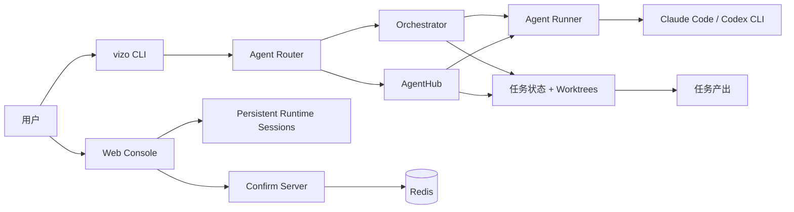

# Vizo

简体中文 | [English](README.md)

Vizo 是面向 Linux 环境下 Codex 和 Claude Code 的浏览器工作台与研发流程编排层。Codex 和 Claude Code 的 CLI 很强，但纯终端并不是完整客户端体验：图片不方便看，生成的文档不方便预览，长任务进度不直观，同时使用 Codex 和 Claude Code 的用户还需要在多个 CLI、多个会话之间来回切换。

Vizo 保留底层 CLI 的能力，同时补上产品化入口：Web Console、图片和文档预览、持久会话、任务历史、模型/runtime 切换，以及可以把一个想法推进到可测试实现的结构化研发工作流。

## Vizo 解决什么问题

Vizo 的出发点很具体：Codex 和 Claude Code 是优秀的 CLI Agent，但终端不是一个完整的客户端。

- **Linux 用户需要真正的工作台**：Vizo 提供浏览器界面来管理会话、任务状态、日志、生成文件、图片预览和文档预览。
- **同时使用多个 AI CLI 的用户需要统一入口**：Vizo 把 Codex 和 Claude Code 放到同一个项目控制台里，减少在不同命令和会话之间切换的成本。
- **长任务需要流程控制**：Vizo 记录进度、产出、费用、恢复点、确认节点、暂停/恢复状态和回滚点。
- **非程序员需要的是研发流程，不只是提示词输入框**：产品经理可以用自然语言描述需求，让 Vizo 按完整研发工作流组织需求分析师、产品经理、架构师、前端、后端、联调、测试和修复等角色，把需求推进到可验证的实现。
- **团队需要可复用结构**：Vizo 把角色 prompt、项目记忆、AgentHub 模块和任务产出组织起来，而不是散落在一次性终端滚屏里。

默认入口是 `vizo`。代码库中仍保留较早的 `opus.py` 入口作为兼容层，因为部分运行时代码仍沿用了历史上的 Opus 命名。

## 核心能力

- **Codex 和 Claude Code 的统一客户端**：在一个浏览器控制台中管理 Linux CLI 型 AI 会话，支持 runtime/model 切换和持久项目上下文。
- **比终端更完整的体验**：在 Vizo Console 中直接预览图片、生成的 Markdown/文档、任务产出、日志和浏览器自动化结果。
- **让非程序员也能发起完整研发流程**：把自然语言需求交给需求分析师、产品经理、架构师、前端、后端、联调、测试和修复工程师等角色分阶段处理。
- **多 Agent 软件交付**：把复杂工作拆成角色化阶段，在关键节点要求确认，并把每一步产出保存为可追踪任务资产。
- **任务控制与恢复**：暂停、恢复、终止、回滚到指定工作流步骤、查看历史、查看成本和回放工作日志。
- **模型路由与降级**：支持在 Claude Code、Codex 和外部模型端点之间按角色配置模型偏好。
- **AgentHub 模块**：运行面向特定领域的 manifest 驱动工作流。公开仓库当前包含合同服务和交互设计两个内置模块。
- **本地优先部署**：可以用 Docker Compose 启动完整栈，也可以用本地 Python 进程配合 Redis 运行。

## 架构概览



常规服务进程是 `python3 -m vizo_core.secretary`。它负责启动并监管 `lib/confirm_server.py`，后者提供 Web Console、确认页、任务 API、产出预览、移动端控制台和 Chrome bridge 端点。

## 仓库结构

| 路径                         | 用途                                           |
| -------------------------- | -------------------------------------------- |
| `vizo`, `vizo.py`          | 公开 CLI shim 和品牌化入口。                          |
| `opus.py`                  | 旧 `opus` 命令兼容入口。                             |
| `vizo_core/`               | CLI 实现、任务编排、AgentHub、agent runtime、UI 和状态管理。 |
| `lib/confirm_server.py`    | Web 服务、任务 API、确认页、预览和控制台路由。                  |
| `lib/web_console.py`       | 桌面 Web Console SPA 处理器和 API。                 |
| `lib/mobile_console.py`    | Mobile Console 处理器。                          |
| `lib/runtime/`             | 持久化 Claude Code 和 Codex 会话 runtime。          |
| `hooks/`                   | 工具调用、会话启动、停止和压缩相关 hook。                      |
| `role_templates/`          | 内置角色 prompt 和引用文档模板。                         |
| `agents/_builtin/`         | 内置 AgentHub 模块。                              |
| `docs/`                    | 聚焦运维和使用的文档。                                  |
| `tests/`                   | 可公开发布的回归测试。                                  |
| `PUBLIC_SYNC_MANIFEST.txt` | 定义哪些文件可以同步到公开仓库的白名单。                         |

## Docker Compose 快速开始

Docker Compose 是评估 Vizo 的推荐方式，因为它会同时启动应用和 Redis。

```bash
git clone <your-vizo-repo-url>
cd vizo-public

cp config.json.example config.json
cp .env.example .env
```

编辑 `.env`，至少设置：

```bash
ANTHROPIC_API_KEY=sk-ant-...
```

对于默认 Compose 端口映射，请确保 `config.json` 使用 `9390`：

```json
{
  "confirm_server": {
    "host": "0.0.0.0",
    "port": 9390
  }
}
```

启动服务：

```bash
docker compose up -d --build
docker compose logs -f vizo
```

打开：

- Web Console: `http://127.0.0.1:9390/vizo/console`
- 健康检查: `http://127.0.0.1:9390/vizo/health`
- Mobile Console: `http://127.0.0.1:9390/vizo/m`

生产部署、本地进程部署、反向代理示例和排障说明见 [docs/DEPLOYMENT.md](docs/DEPLOYMENT.md)。

## 本地 CLI 设置

当你要开发 Vizo 本身，或希望不通过容器直接运行 CLI 时，可以使用本地 Python 环境。

```bash
python3 -m venv .venv
source .venv/bin/activate
pip install -r requirements.txt

cp config.json.example config.json
cp .env.example .env
```

安装并认证你计划使用的 AI CLI runtime，并确保它在 `PATH` 中可用。Docker 镜像会预装 Claude Code、Codex、Playwright MCP 和 Chromium；本地进程运行时则需要操作者自行准备等价工具。

运行 Vizo：

```bash
./vizo "add a login rate limit"
./vizo --chat "summarize the current project"
./vizo --history
./vizo --cost
./vizo --resume
```

直接启动 Web 服务：

```bash
python3 lib/confirm_server.py start -f -p 9390
```

或启动 supervisor：

```bash
python3 -m vizo_core.secretary
```

## 常用 CLI 命令

| 命令                                          | 作用                       |
| ------------------------------------------- | ------------------------ |
| `./vizo "task"`                             | 启动一个路由任务。                |
| `./vizo "task" --dev`                       | 强制走研发工作流，跳过 AgentHub 路由。 |
| `./vizo --workflow bug_fix "task"`          | 运行指定研发工作流。               |
| `./vizo --chat "question"`                  | 直接问答，不进入完整工作流。           |
| `./vizo --task`                             | 列出任务。                    |
| `./vizo --task <task_id>`                   | 查看单个任务。                  |
| `./vizo --pause [task_id]`                  | 请求暂停任务。                  |
| `./vizo --resume [--task-id <task_id>]`     | 恢复未完成任务。                 |
| `./vizo --rollback <task_id> --step <step>` | 回滚到指定工作流步骤。              |
| `./vizo --terminate <task_id>`              | 终止任务，默认会回滚。              |
| `./vizo agents`                             | 列出已安装的 AgentHub 模块。      |

## 配置

Vizo 读取 `config.json`，然后应用支持的环境变量覆盖。不要把真实密钥提交到 Git。本地开发使用 `.env`，生产环境使用部署平台的 secret store。

重要变量：

| 变量                                                | 用途                                   |
| ------------------------------------------------- | ------------------------------------ |
| `ANTHROPIC_API_KEY` 或 `OPUS_MAIN_API_KEY`         | 主 Anthropic-compatible API key。      |
| `ANTHROPIC_BASE_URL`                              | 可选 Anthropic-compatible endpoint 覆盖。 |
| `DEEPSEEK_API_KEY`, `GLM_API_KEY`, `QWEN_API_KEY` | 可选外部模型 key。                          |
| `REDIS_HOST`, `REDIS_PORT`                        | Redis 连接覆盖。                          |
| `CONFIRM_SERVER_HOST`, `CONFIRM_SERVER_PORT`      | Web 服务绑定配置。                          |
| `PUBLIC_BASE_URL`                                 | 生成预览链接时使用的公开基础 URL。                  |

## Web 路由

主路由前缀是 `/vizo`。服务端也会为许多路由注册去版本前缀的别名，但新文档和新集成应优先使用显式的 `/vizo/...` 路径。

| 路由                           | 用途                 |
| ---------------------------- | ------------------ |
| `/vizo/console`              | 桌面 Web Console。    |
| `/vizo/console/setup`        | 首次运行设置向导。          |
| `/vizo/tasks`                | 任务列表页。             |
| `/vizo/tasks/{task_id}`      | 任务详情页。             |
| `/vizo/confirm/{request_id}` | 人工确认页。             |
| `/vizo/preview/{preview_id}` | 产出预览页。             |
| `/vizo/docs/`                | 生成任务文档列表。          |
| `/vizo/chrome/connect`       | Chrome bridge 连接页。 |
| `/vizo/health`               | 服务健康检查。            |

## 测试

公开回归测试位于 `tests/`。

```bash
python3 -m pytest tests
```

修改特定子系统时优先运行聚焦测试，例如：

```bash
python3 -m pytest tests/test_sync_public_repo.py
python3 -m pytest tests/test_confirm_server_status.py
```

## 公开仓库边界

公开仓库通过白名单同步维护：

```bash
python3 scripts/sync_public_repo.py --target "$HOME/vizo-public" --dry-run
python3 scripts/sync_public_repo.py --target "$HOME/vizo-public" --init-git
```

如果一个新文件需要公开发布，请把它加入 `PUBLIC_SYNC_MANIFEST.txt`。同步时，未列在该文件中的内容会从公开 checkout 中移除，显式保护的路径如 `.git` 除外。

## 安全说明

- 不要提交 `config.json`、`.env`、`.mcp.json`、任务状态、日志、本地记忆、用户创建的 Agent 或项目 checkout。
- 复制 `config.json.example` 到生产环境前要先审查。它包含占位符和示例值，不是经过加固的生产策略。
- 将 Web Console 暴露到非完全可信网络前，请先使用反向代理和 TLS。
- 面向 localhost 之外部署时，请用反向代理、防火墙、VPN 或其他外部访问控制限制 Web Console 入口。
- 广泛发布前请选择并添加许可证。没有许可证时，其他人可以查看代码，但不会获得明确的复用权利。

## 更多文档

- [部署指南](docs/DEPLOYMENT.md)
- [用户手册](docs/USER-MANUAL.md)
